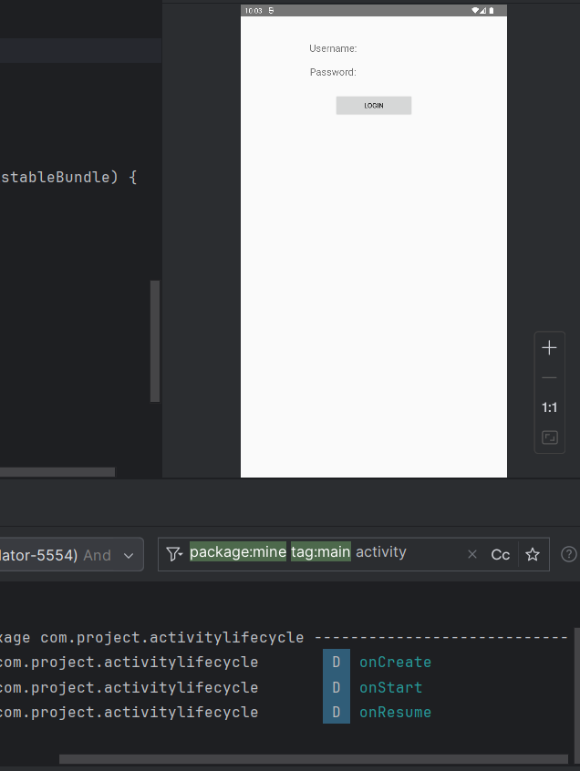
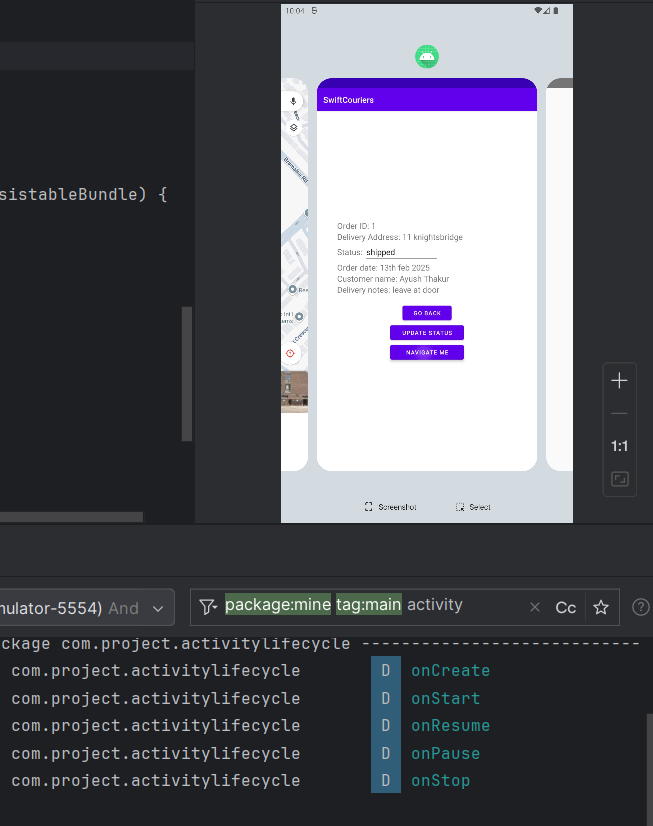
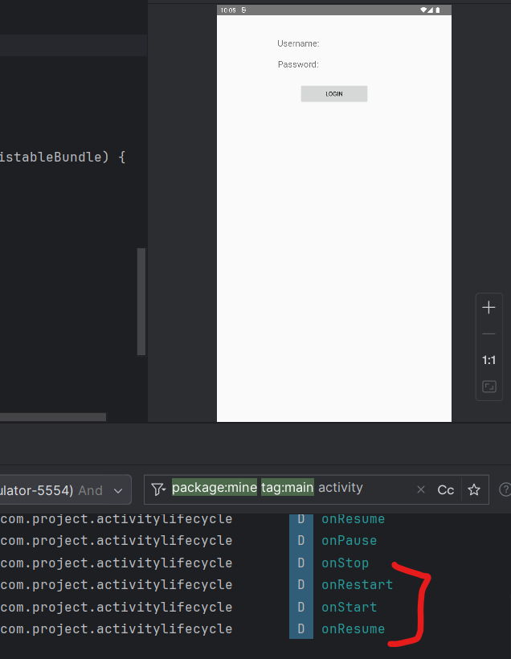
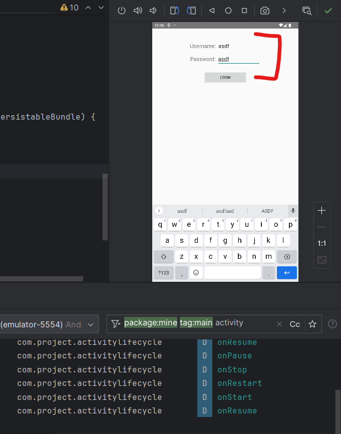
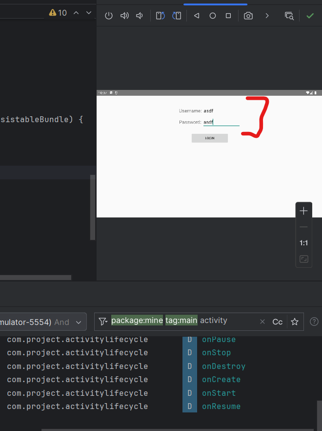

# Android Activity Lifecycle - Case Study
> by Ayush Thakur(N01649393)

In this project, we discover the inner workings of a activity's Lifecycle in android. This includes iterating through multiple methods like onCreate(), onStart() and more...

The correct sequence of these events are shown below:
```
onCreate()
    |
onRestart()
    |
onStart()
    |
onResume()
    |
-- Activity Running --
    |
onPause()
    |
onStop()
    |
onDestroy()
```

The main purpose of this project is to see the activity lifecycle being executed. Here are some previews:

### When the app is opened


### When the app is kept in the background


### When the app is brought to the foreground again


-------

## Save instance
We also explore saving the instance of the application so that the data persist even when the activity is destroyed and recreated. 

We have this UI:


Now we write some data and rotate the application, and see how the data still persist even when the activity is recreated
